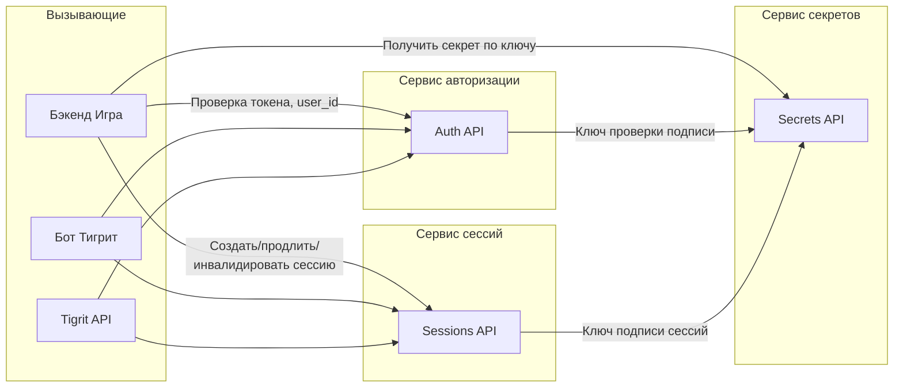

# Архитектура микросервисов

Принципы размежевания сервисов: каждый сервис обращается только к тому, кто по логике решает задачу (по контракту API). Менеджера/оркестратора нет — маршрутизация по URL в API Gateway; сервисы не знают друг о друге, кроме явного контракта.

---

## Диаграмма: кто к кому обращается

---

## Список сервисов

| Сервис | Назначение | Контракт (детали) |
|--------|------------|--------------------|
| **Авторизация/аутентификация** | Единственный источник «кто пользователь». Проверка токена/initData/JWT → user_id или 401. Не хранит сессии. | [03_Сервис_авторизации_и_аутентификации.md](03_Сервис_авторизации_и_аутентификации.md) |
| **Сессии** | Создание, продление, инвалидация, проверка сессий. Хранение в Redis или БД. Не знает логики авторизации. | [02_Сервис_сессий.md](02_Сервис_сессий.md) |
| **Секреты** | Выдача значений по ключу (INTERNAL_API_SECRET, SESSION_SIGNING_KEY, JWT_SECRET и т.д.) для доверенных вызывающих. Только чтение/кэш. | [04_Сервис_секретов.md](04_Сервис_секретов.md) |

---

## Правило границ

- **Сервис не знает о другом сервисе** — только о контракте (URL, формат запроса/ответа из документации).
- **Обращение строго по логике:** нужен user_id → вызов Auth; нужна сессия → вызов Sessions; нужен секрет для подписи/проверки → вызов Secrets.
- **Нет оркестратора:** API Gateway маршрутизирует по домену/path; каждый вызывающий (бэкенд, бот, tigrit-api) сам решает, к какому сервису идти, по этой документации.

## Работоспособность и независимость

- **Secrets:** не вызывает другие сервисы; GET /health → 200 при работе процесса.
- **Auth:** может работать без Secrets при задании TELEGRAM_BOT_TOKEN в env; ensure-user зависит от бэкенда Игра (при недоступности — 503).
- **Sessions:** зависит только от Redis; GET /health → 503 при недоступности Redis. SESSION_SIGNING_KEY в env устраняет обращение к Secrets.

Детали — в разделах «Работоспособность и независимость» в документах 02, 03, 04.

- **Бот Тигрит:** при недоступности бэкенда Игра (ensure-user API) не падает: возвращает пользователю «Сервис игры временно недоступен» и пропускает запись в tigrit_interactions до восстановления.

---

## Отличие от монолита

В монолите один процесс держит и авторизацию, и сессии, и секреты в env. В этой схеме: Auth, Sessions, Secrets — отдельные процессы/контейнеры со своими папками; общая только сеть и контракты. Это позволяет менять или масштабировать один сервис без касания других и держать секреты в одном месте (сервис секретов).

Детали контрактов и папок в репозитории — в документах 02, 03, 04.
